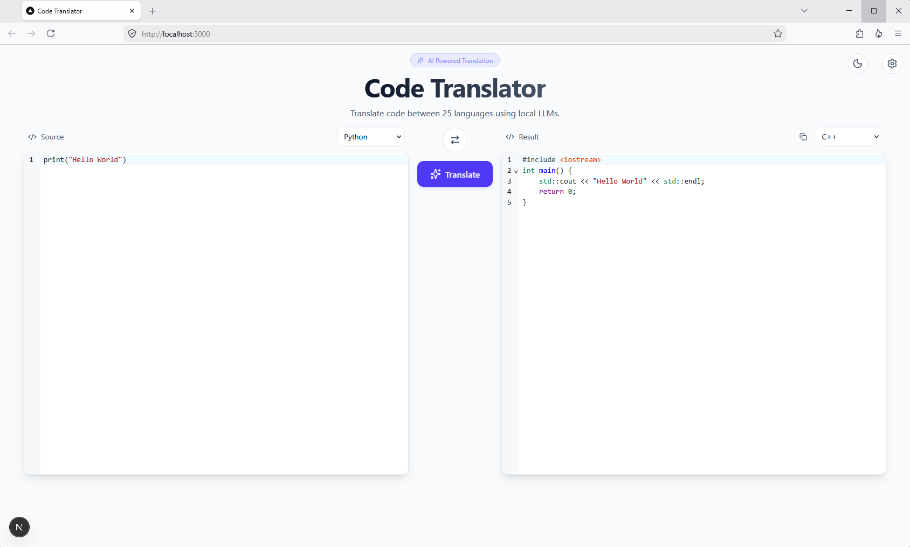
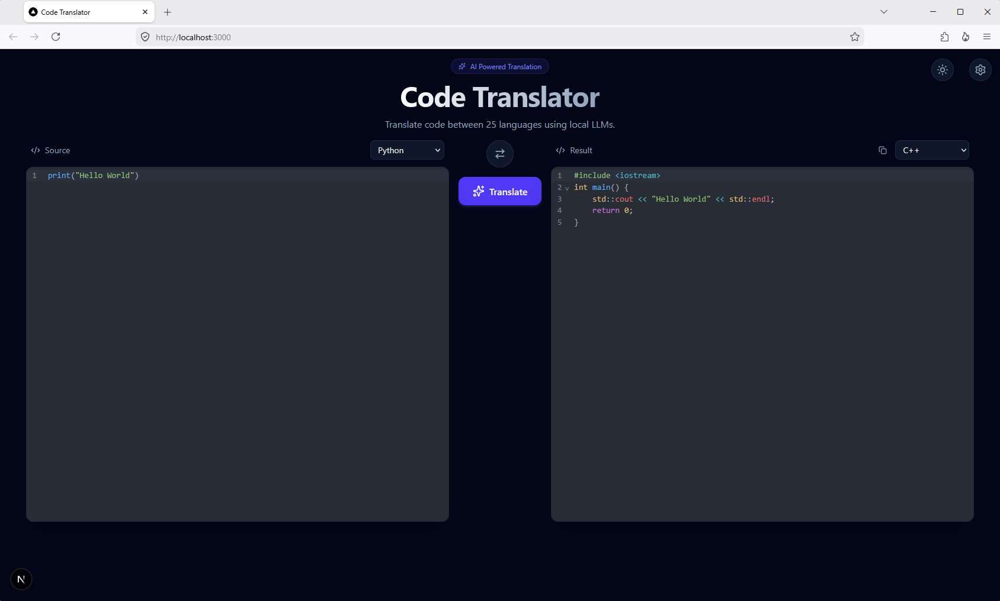

# Code Translator

Translate code between 26 programming languages using local LLMs via a clean, modern editor interface. This tool is built for educational purposes and shall not be used for production-level code!

<table align="center">
<tbody>
<tr>
<td align="center"></td>
<td align="center"></td>
</tr>
</tbody>
</table>

## Features

- **26 languages** — Python, JavaScript, TypeScript, C/C++, Java, Go, Rust, PHP, Ruby, Swift, Shell, and more
- **Local-first** — All translations run on your machine via `llama-server` (llama.cpp)
- **Syntax highlighting** — Real-time language-aware highlighting powered by CodeMirror 6
- **Dark & light themes** — Toggle with one click; preferences persist in localStorage
- **Keyboard shortcuts** — `Ctrl+Enter` / `Cmd+Enter` to translate instantly
- **Copy to clipboard** — One-click copy for translated output

## Quick Start

### Prerequisites

1. **Node.js 18+** and **npm**
2. **llama.cpp** with the OpenAI-compatible server — either from [llama.cpp](https://github.com/ggerganov/llama.cpp) or [Ollama](https://ollama.com/)

### Install & Run

```bash
# Clone and install dependencies
git clone https://github.com/mschlotter/code-translator.git
cd code-translator
npm install

# Configure the LLM server
cp .env.example .env.local
# then edit .env.local and set your server URL and model name

# Start the development server
npm run dev

# Build for production
npm run build
npm start
```

Open [http://localhost:3000](http://localhost:3000).

## Configuration

### Environment Variables

Copy `.env.example` to `.env.local` and set the following:

| Variable | Required | Description | Example |
|---|---|---|---|
| `NEXT_PUBLIC_LLAMA_SERVER_URL` | Yes | URL of your local LLM server | `http://localhost:11435` |
| `NEXT_PUBLIC_DEFAULT_MODEL` | Yes | Default model to use | `unsloth/Qwen3.6-35B-A3B-GGUF:Q5_K_XL` |
| `MAX_CODE_SIZE` | No | Max code size in bytes (default: 100KB) | `102400` |

### LLM Servers

#### Llama.cpp in router mode

For example:
```bash
llama-server --models-dir ./models --port 11435
```
Or using a configuration file:
```bash
llama-server --models-preset ./models.ini --port 8080
```

## Project Structure

```
code-translator/
├── src/
│   ├── app/
│   │   ├── api/translate/route.ts   # API route to llama-server
│   │   ├── globals.css              # Theme CSS variables
│   │   ├── layout.tsx               # Root layout
│   │   └── page.tsx                 # Main app shell
│   ├── components/
│   │   └── translator.tsx           # UI components
│   ├── config/
│   │   ├── languages.ts             # 26 supported languages
│   │   └── server.ts                # Server config constants
│   └── hooks/
│       ├── useSettings.ts           # Theme + server/model state
│       └── useTranslation.ts        # Translation API calls
├── public/                          # Static assets
├── .env.example                     # Template env file
├── package.json
└── tsconfig.json
```

## Tech Stack

- **Framework**: Next.js 16 (App Router)
- **Language**: TypeScript
- **Styling**: Tailwind CSS v4
- **Editors**: CodeMirror 6
- **Icons**: Lucide React
- **LLM Backend**: llama.cpp (llama-server) via OpenAI-compatible API

## Scripts

| Command | Description |
|---|---|
| `npm run dev` | Start development server |
| `npm run build` | Build for production |
| `npm start` | Start production server |
| `npm run lint` | Run ESLint |

## Browser Support

Modern browsers (Chrome, Firefox, Safari, Edge).

## License

This project is licensed under the MIT License.
